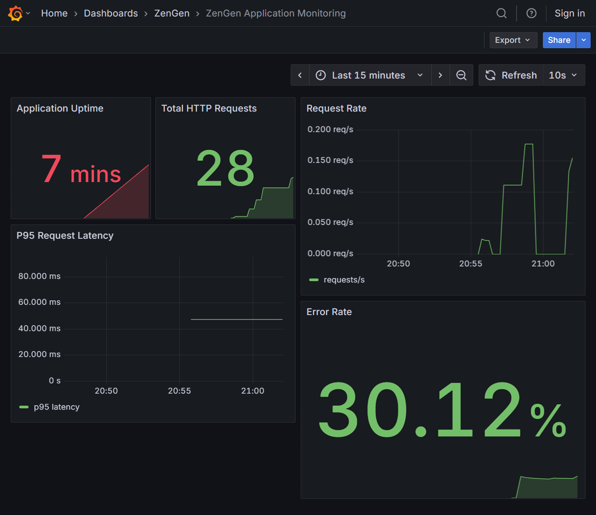
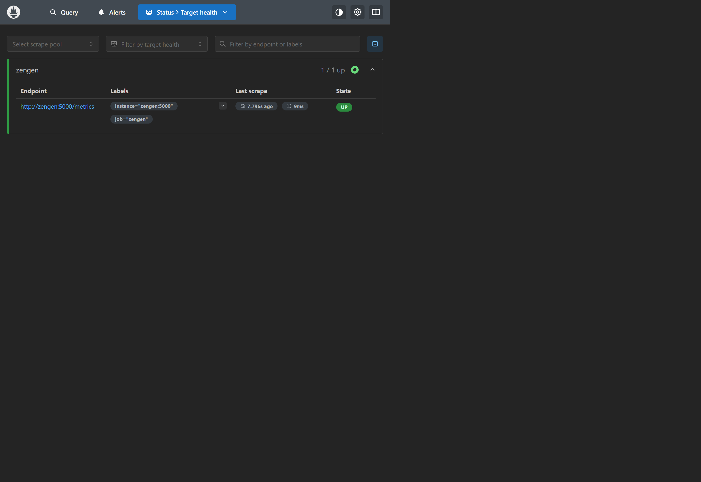
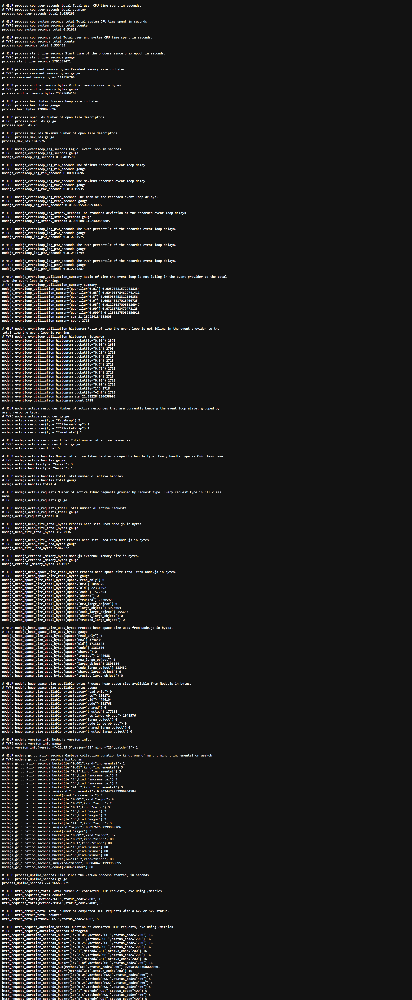

# ZenGen – DevOps CA-II Comprehensive Case Study & Report

**Student:** Mohammed Yousef Saeed Al-Hajj  
**PRN:** 23070122141  
**Batch / Semester:** 2023–2027 | Seventh Semester  
**Subject:** DevOps + Lab (Continuous Assessment II)  
**Group No.:** 25  
**Live Production Application:** [https://zengen-prediction-platform.netlify.app](https://zengen-prediction-platform.netlify.app)  
**Devpost Hackathon Submission:** [https://devpost.com/software/zengen-ai-powered-mental-wellness-platform](https://devpost.com/software/zengen-ai-powered-mental-wellness-platform)  
**Student Fork (Submission Repo):** [https://github.com/Mohammedyouse/DevOps-CA2_2023_27](https://github.com/Mohammedyouse/DevOps-CA2_2023_27)  
**Faculty Base Repository:** [https://github.com/aditisharmas11/DevOps-CA2_2023_27](https://github.com/aditisharmas11/DevOps-CA2_2023_27)  

---

## 1. Project Overview

**ZenGen** is an AI-powered mental wellness platform designed specifically for adolescents and students. It provides evidence-based self-assessments, mood and anxiety tracking, interactive somatic grounding exercises, verified medical resource libraries, and real-time supportive AI counseling powered by **Google Gemini 3.8 Flash** with automated crisis escalation.

This DevOps Case Study demonstrates end-to-end industry-standard DevOps engineering practices implemented for ZenGen, including:
1. **Continuous Integration & Delivery (CI/CD)** via multi-job GitHub Actions workflows.
2. **Containerization** via multi-stage Node 22 Docker configuration.
3. **Container Orchestration** with Kubernetes Deployment, Service manifests, and secure Secret injection.
4. **Rolling Update & Automated Rollback** validation on Kubernetes.
5. **Configuration Management** with Ansible inventory and playbooks.
6. **Application Performance Monitoring & Observability** with Prometheus scrape endpoints (`/metrics`) and custom 5-panel Grafana dashboards.
7. **Production Edge Deployment** on Netlify with Serverless API routing.
8. **External Hackathon Submission** on Devpost.

---

## 2. DevOps Architecture

```mermaid
flowchart TD
    subgraph Developer Workspace
        DEV[Developer Commit & Push]
    end

    subgraph GitHub CI/CD Pipeline
        GA1[ZenGen CI Pipeline\nNode 20, npm check, tests, build]
        GA2[Kubernetes Validation\nkubeconform strict YAML linting]
        GA3[Kubernetes Rollout Demo\nKinD cluster, update, rollback]
    end

    subgraph Container & Deployment
        DOC[Docker Image Build\nNode 22 Alpine]
        K8S[Kubernetes Cluster\n2 Replicas, NodePort 30080, Probes]
        NET[Netlify Production Edge\nReact Frontend + Serverless Express]
    end

    subgraph Configuration & Data
        ANS[Ansible Playbook\nPackage setup & service user]
        NEON[(Neon PostgreSQL Serverless\nDatabase)]
        GEM[Google Gemini 3.8 Flash AI]
    end

    subgraph Monitoring & Observability
        MET[/metrics Prometheus Endpoint\n@prometheus-io/client]
        PROM[Prometheus Server\nScrape Job 'zengen' :5000]
        GRAF[Grafana 12 Dashboard\n5 Telemetry Panels :3000]
    end

    DEV --> GA1
    DEV --> GA2
    DEV --> GA3
    GA1 --> DOC
    DOC --> K8S
    K8S --> NEON
    K8S --> GEM
    NET --> NEON
    NET --> GEM
    ANS -.-> K8S
    K8S --> MET
    MET --> PROM
    PROM --> GRAF
```

---

## 3. Technologies Used

* **Version Control & CI/CD**: Git, GitHub, GitHub Actions
* **Containerization**: Docker, Docker Compose, Alpine Linux
* **Container Orchestration**: Kubernetes (KinD / Docker Desktop), `kubeconform`
* **Configuration Management**: Ansible
* **Observability & Metrics**: Prometheus v3.5, Grafana v12, `@prometheus-io/client`
* **Application Framework**: Node.js 20/22, Express, TypeScript, Vite, React 18
* **Database & AI**: Neon PostgreSQL (Serverless), Drizzle ORM, Google Gemini 3.8 Flash
* **Cloud & Serverless**: Netlify Edge CDN & Netlify Functions

---

## 4. Continuous Integration Pipeline (GitHub Actions)

The repository defines three GitHub Actions workflows in `.github/workflows/`:

### 4.1 Application CI Pipeline (`.github/workflows/ci.yml`)
* **Triggers**: On push and pull request to `main`.
* **Environment**: `ubuntu-latest`, Node.js 20.
* **Steps Executed**:
  1. Repository checkout (`actions/checkout@v4`).
  2. Setup Node.js with npm caching (`actions/setup-node@v4`).
  3. Clean dependency installation (`npm ci`).
  4. TypeScript type checking (`npm run check` via `tsc`).
  5. Automated unit and metrics test suite (`npm test`).
  6. Production application bundling (`npm run build`).

### 4.2 Kubernetes Manifest Validation (`.github/workflows/kubernetes-validation.yml`)
* **Tool**: `kubeconform` strict schema validation (`setup-kubeconform@v1`).
* **Manifests Verified**:
  * `devops/kubernetes/deployment.yaml`
  * `devops/kubernetes/service.yaml`

### 4.3 Kubernetes Rollout & Rollback Demonstration (`.github/workflows/kubernetes-rollout-demo.yml`)
* **Cluster**: Ephemeral Kubernetes in Docker (KinD) cluster (`helm/kind-action@v1.12.0`).
* **Phases**:
  1. Creates an initial deployment and monitors rollout completion.
  2. Executes a zero-downtime rolling update to a newer image version.
  3. Triggers an intentional invalid deployment to verify failure detection.
  4. Executes `kubectl rollout undo` to demonstrate automated recovery to the last healthy revision.

---

## 5. Docker Configuration

* **`Dockerfile`**: Builds a lightweight container using `node:22-alpine`.
* **Security & Clean Context**: `.dockerignore` excludes `.env`, secrets, `.git`, `node_modules`, and build artifacts from the image context.
* **Health Check Integration**: Exposes port `5000` with HTTP `/health` probes.

### Build and Run Locally
```bash
# Build the container image
docker build -t zengen:latest .

# Run container with environment configuration
docker run -d -p 5000:5000 --env-file .env --name zengen-app zengen:latest

# Check health
curl http://localhost:5000/health
```

---

## 6. Kubernetes Orchestration

* **`devops/kubernetes/deployment.yaml`**:
  * **Replicas**: 2 pods for high availability.
  * **Probes**:
    * `readinessProbe`: HTTP GET on `/health` (initialDelay 10s, period 5s).
    * `livenessProbe`: HTTP GET on `/health` (initialDelay 20s, period 10s).
  * **Resource Constraints**:
    * Requests: CPU 100m, Memory 128Mi.
    * Limits: CPU 500m, Memory 512Mi.
  * **Security**: Secrets (`DATABASE_URL`, `GEMINI_API_KEY`, `SESSION_SECRET`) injected via `secretKeyRef` from `zengen-secrets`.
* **`devops/kubernetes/service.yaml`**:
  * Exposes pods via NodePort `30080` on port `5000`.

### Apply Manifests
```bash
# Create Kubernetes Secret securely without committing values
kubectl create secret generic zengen-secrets --from-env-file=.env --dry-run=client -o yaml | kubectl apply -f -

# Deploy application and service
kubectl apply -f devops/kubernetes/deployment.yaml
kubectl apply -f devops/kubernetes/service.yaml

# Verify deployment status
kubectl rollout status deployment/zengen-deployment
kubectl get pods,svc -l app=zengen
```

---

## 7. Rolling Update & Rollback Demonstration

Kubernetes rolling update guarantees zero downtime by progressively replacing old pods with new ones.

```bash
# 1. Update container image version
kubectl set image deployment/zengen-deployment zengen=zengen:v2

# 2. Monitor rollout status
kubectl rollout status deployment/zengen-deployment

# 3. View rollout history
kubectl rollout history deployment/zengen-deployment

# 4. In case of issues, perform immediate rollback to previous revision
kubectl rollout undo deployment/zengen-deployment

# 5. Confirm restored revision status
kubectl rollout status deployment/zengen-deployment
```

---

## 8. Ansible Configuration Management

* **`devops/ansible/inventory.ini`**: Defines target inventory group `[webservers]`.
* **`devops/ansible/playbook.yml`**:
  * Installs core system packages (`curl`, `git`).
  * Creates `/opt/zengen` application directory with `0755` permissions.
  * Creates dedicated unprivileged system service user `zengen`.
  * Templates baseline `/opt/zengen/app.conf` configuration.

### Run Ansible Playbook
```bash
ansible-playbook -i devops/ansible/inventory.ini devops/ansible/playbook.yml
```

---

## 9. Monitoring & Observability Stack

The monitoring infrastructure consists of **Prometheus v3.5** and **Grafana v12** defined in `devops/monitoring/docker-compose.yml`:

### 9.1 Prometheus Metrics Endpoint (`/metrics`)
ZenGen instruments HTTP metrics using `@prometheus-io/client`:
* `process_uptime_seconds`: Process uptime gauge.
* `http_requests_total`: Request counter labeled by HTTP method and status code.
* `http_errors_total`: Counter tracking 4xx and 5xx client/server errors.
* `http_request_duration_seconds`: Histogram measuring response latency across configurable buckets.
* Note: The middleware automatically normalizes status codes and excludes `/metrics` from scraping counts to eliminate observer effect.

### 9.2 Grafana Provisioned Dashboard
Grafana automatically provisions datasource `Prometheus` and dashboard `zengen-overview.json` containing 5 real-time panels:
1. **Application Uptime** (`process_uptime_seconds`)
2. **Total HTTP Requests** (`http_requests_total`)
3. **Request Rate (req/sec)** (`sum(rate(http_requests_total[1m]))`)
4. **P95 Request Latency** (`histogram_quantile(0.95, sum(rate(http_request_duration_seconds_bucket[1m])) by (le))`)
5. **HTTP Error Rate** (`sum(rate(http_errors_total[1m]))`)

### Run Monitoring Stack
```bash
docker compose -f devops/monitoring/docker-compose.yml up --build -d
```
* **ZenGen App**: `http://localhost:5000`
* **Prometheus Targets**: `http://localhost:9090/targets`
* **Grafana Dashboard**: `http://localhost:3000/d/zengen-monitoring/zengen-application-monitoring`

---

## 10. Evidence Screenshots

The monitoring stack and endpoints were executed and verified locally. Genuine screenshot captures are included directly in `devops/evidence/`:

### 10.1 Grafana Monitoring Dashboard
*All 5 telemetry panels reporting live traffic metrics:*


### 10.2 Prometheus Target Health
*Prometheus reporting the `zengen` scrape target in state UP:*


### 10.3 ZenGen Prometheus Metrics Endpoint
*Raw `/metrics` response showing process uptime, request counters, and latency histograms:*


---

## 11. External Hackathon Participation

* **Challenge**: Global Health & Wellness Innovation Track
* **Platform**: Devpost
* **Project Name**: ZenGen — AI-Powered Mental Wellness Platform
* **Submission Link**: [https://devpost.com/software/zengen-ai-powered-mental-wellness-platform](https://devpost.com/software/zengen-ai-powered-mental-wellness-platform)
* **Description**: ZenGen was developed and submitted to demonstrate full-stack AI mental health support, combining clinical questionnaires, Google Gemini 3.8 Flash empathetic dialog, and production DevOps engineering.

---

## 12. Production Deployment (Netlify)

* **Public Production URL**: [https://zengen-prediction-platform.netlify.app](https://zengen-prediction-platform.netlify.app)
* **Architecture**: Vite React SPA hosted on Netlify CDN Edge; Express API and Gemini backend routed via Netlify Serverless Functions (`netlify/functions/api.mjs`).
* **Database**: Neon Serverless PostgreSQL (`aws-ap-southeast-1`).
* **Security**: Zero secrets committed to Git; environment variables managed securely through Netlify Environment Variables.

---

## 13. CA-II Submission Verification Checklist

| Requirement | Implementation File / Evidence | Status |
| :--- | :--- | :--- |
| **GitHub Actions CI Pipeline** | `.github/workflows/ci.yml` (Build, check, test) | **COMPLETE** |
| **Kubernetes Validation** | `.github/workflows/kubernetes-validation.yml` (kubeconform) | **COMPLETE** |
| **Kubernetes Rollout/Rollback** | `.github/workflows/kubernetes-rollout-demo.yml` & docs | **COMPLETE** |
| **Docker Configuration** | `Dockerfile`, `.dockerignore` | **COMPLETE** |
| **Kubernetes Manifests** | `devops/kubernetes/deployment.yaml`, `service.yaml` | **COMPLETE** |
| **Ansible Configuration** | `devops/ansible/inventory.ini`, `playbook.yml` | **COMPLETE** |
| **Prometheus Metrics Endpoint** | `server/metrics.ts`, `devops/monitoring/prometheus.yml` | **COMPLETE** |
| **Grafana Dashboard** | `devops/monitoring/grafana/dashboards/zengen-overview.json` | **COMPLETE** |
| **Genuine Evidence Screenshots** | `devops/evidence/06A...png`, `06B...png`, `06C...png` | **COMPLETE** |
| **Hackathon Submission Link** | Devpost challenge link included | **COMPLETE** |
| **Security Hygiene** | `.env` excluded, secrets safely managed | **VERIFIED** |
